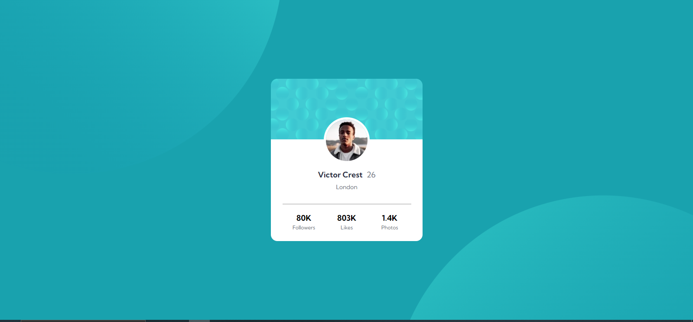

# Frontend Mentor - Profile card component solution

This is a solution to the [Profile card component challenge on Frontend Mentor](https://www.frontendmentor.io/challenges/profile-card-component-cfArpWshJ). Frontend Mentor challenges help you improve your coding skills by building realistic projects. 

## Table of contents

- [Overview](#overview)
  - [The challenge](#the-challenge)
  - [Screenshot](#screenshot)
  - [Links](#links)
- [My process](#my-process)
  - [Built with](#built-with)
  - [What I learned](#what-i-learned)
- [Author](#author)

## Overview

### The challenge

- Build out the project to the designs provided

### Screenshot

### Links

- Live Site URL: https://laisaffonso.github.io/profile-card-component-main/

## My process

### Built with

- Semantic HTML5 markup
- CSS custom properties
- Flexbox

### What I learned

How to use Flexbox and media queries

## Author

- [Lais Affonso]
- Frontend Mentor - [@laisaffonso](https://www.frontendmentor.io/profile/laisaffonso)
- Twitter - [@laa_angel](https://www.twitter.com/laa_angel)
- Github - [@laisaffonso](https://www.github.com/laisaffonso)
